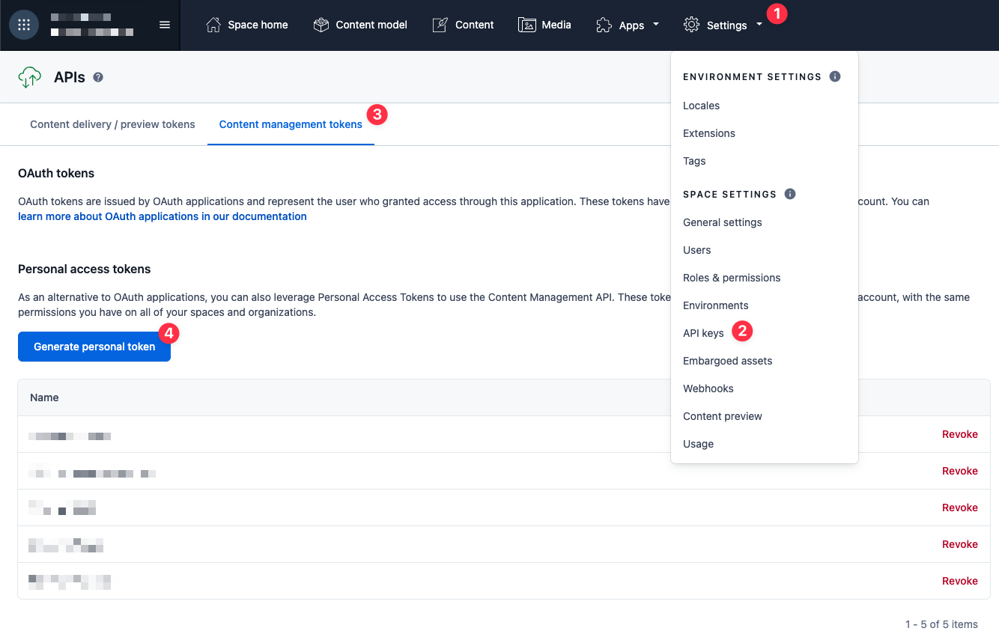

# Dream Cheesers - Next.js + Contentful

A modern Next.js website using Contentful as a headless CMS. This project has been reworked from the original Netlify template to use a more traditional Next.js approach with clean component architecture.

## Features

- **Next.js 15** - Latest version with App Router
- **Contentful CMS** - Headless content management
- **Tailwind CSS** - Utility-first CSS framework
- **TypeScript Ready** - Easy to migrate to TypeScript
- **SEO Optimized** - Built-in metadata and SEO features

## Prerequisites

Before you begin, please make sure you have the following:

- [Contentful account](https://www.contentful.com/)
- Node v18+ or later
- (optional) [nvm](https://github.com/nvm-sh/nvm) for Node version management.

## Getting Started

### Clone this repository

Fork and clone your repository, then run `npm install` in its root directory.

### Create Contentful Space

After signing into Contentful, create a new space. 

### Generate Management Token

If you don't already have a management token (or _personal access token_), generate one. To do so, go into your new empty space, then:

1. Click _Settings_
1. Choose _API Keys_
1. Select the _Content management tokens_ tab
1. Click the button to generate a new token



### Generate Preview & Delivery API Keys

From the same place you generated the management token, you can now generate API access keys.

1. Select the *content delivery / preview tokens* tab
1. Choose *Add API key*

### Set Environment Variables

Create a `.env.local` file in your project root and add your Contentful credentials:

```bash
CONTENTFUL_SPACE_ID=your_space_id_here
CONTENTFUL_DELIVERY_TOKEN=your_delivery_token_here
CONTENTFUL_PREVIEW_TOKEN=your_preview_token_here
CONTENTFUL_MANAGEMENT_TOKEN=your_management_token_here
```

Note: the Contentful space ID can be viewed and copied via *Settings->General Settings* in Contentful.

### Import Content (Optional)

If you want to use the existing content models, import them into Contentful:

    npm run import

### Run the Website

Install dependencies and run the Next.js development server:

    npm install
    npm run dev

Visit [localhost:3000](http://localhost:3000) to see your website.

## Project Structure

```
src/
  app/
    layout.jsx          # Root layout component
    page.jsx            # Homepage with custom design
    [...slug]/
      page.jsx          # Dynamic page routing
  components/
    Button.jsx          # Reusable button component
    Hero.jsx            # Hero section component
    Stats.jsx           # Statistics section component
  utils/
    content.js          # Contentful API utilities
```

## Customization

This project uses a traditional Next.js approach, making it easy to:

- **Add new pages** - Create new files in `src/app/`
- **Create components** - Add React components in `src/components/`
- **Style with CSS** - Use Tailwind classes or custom CSS
- **Fetch content** - Use utilities from `src/utils/content.js`

## Content Management

Content is managed through Contentful and fetched using clean utility functions:

- `getHomepageContent()` - Fetches hero and stats content
- `getContentByType(type)` - Fetches all entries of a specific type
- `getPageFromSlug(slug)` - Fetches page content by URL slug

## Deployment

Deploy to your preferred platform:

- **Vercel** - Connect your GitHub repo to Vercel
- **Netlify** - Connect your GitHub repo to Netlify  
- **Any Node.js host** - Run `npm run build` and deploy the `.next` folder
